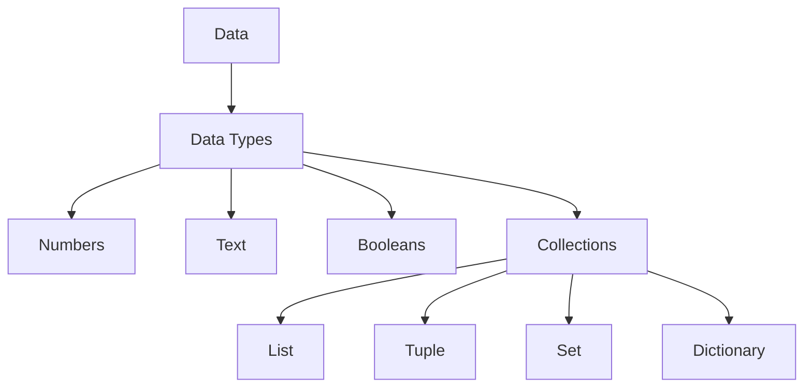

# 04 - Data Types

Welcome to the Data Types module of the Python Programming Foundation repository. In this module, you will learn how Python represents information, why data types matter, and how to choose the right type for clarity, performance, and reliability.

> This module is designed for complete beginners, computer science students, AI learners, self-learners, and future software engineers.

## 1. Introduction

A program is built from data and operations. Data types tell Python what kind of value a variable contains and what operations are allowed on it. They are one of the most important foundations of Python programming.

In Python, everything is an object. Every value has a type, and that type defines how the value behaves.

## 2. Learning Objectives

By the end of this module, you will be able to:

- define what a data type is and why it matters
- explain dynamic typing and Python's object model
- distinguish mutable and immutable types
- identify the main built-in Python data types
- convert values safely between types
- choose appropriate data types for common problems
- use data types in real-world and AI-related examples

## 3. Prerequisites

Before starting this module, you should be comfortable with:

- variables
- basic input and output
- arithmetic operations
- simple control flow
- functions (helpful but not required)

## 4. Why Data Types Matter

Data types matter because they:

- make code safer and easier to understand
- prevent invalid operations
- improve memory usage
- influence performance
- support machine learning and AI pipelines
- make data processing more predictable

## 5. Where Data Types Are Used

Data types appear everywhere:

- storing user profiles
- processing financial records
- building web applications
- analyzing scientific datasets
- training machine learning models
- parsing text and documents
- managing configuration files

## 6. AI Applications

Data types are essential in AI and data science:

- numeric data for model training
- strings for text processing
- lists and dictionaries for feature storage
- booleans for decision logic
- bytes and memoryview for binary data pipelines
- tuples for immutable structured records

## 7. Real-World Examples

- A bank stores balances as numbers.
- A chatbot stores user messages as strings.
- A shopping app records products in dictionaries.
- A recommendation system stores features in lists.
- A weather app stores flags as booleans.

## 8. Folder Overview

- [theory.md](theory.md) — deep explanation of Python data types and internals
- [examples.md](examples.md) — practical examples
- [cheatsheet.md](cheatsheet.md) — one-page reference guide
- [notes.md](notes.md) — concise study notes
- [interview-questions.md](interview-questions.md) — beginner to advanced interview questions
- [common-mistakes.md](common-mistakes.md) — common beginner errors
- [best-practices.md](best-practices.md) — professional guidance
- [exercises.md](exercises.md) — practice tasks
- [assignments.md](assignments.md) — practical assignments
- [quiz.md](quiz.md) — 100 MCQs with answers
- [project.md](project.md) — mini project
- [summary.md](summary.md) — short review guide
- [references.md](references.md) — trusted learning resources
- [assets](assets) — diagrams and illustrations
- [code](code) — executable Python examples
- [solutions](solutions) — sample solutions
- [challenge](challenge) — bonus challenges

## 9. Learning Outcomes

After completing this module, you should be able to:

1. explain the role of data types in programming
2. distinguish between mutable and immutable objects
3. work confidently with numbers, text, booleans, and collections
4. use type conversion correctly
5. write clearer and more efficient Python programs

---

## 10. Quick Concept Map

---

## 11. Start Here

Begin with [theory.md](theory.md), then explore [examples.md](examples.md), and finish by solving the exercises in [exercises.md](exercises.md).
