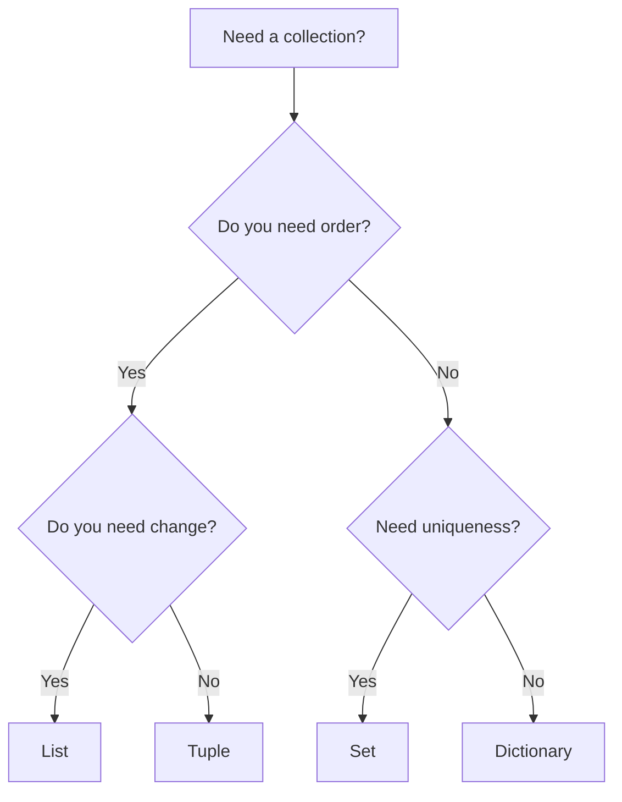

# Collection Selection Flowchart

```mermaid
flowchart TD
    A[Need a collection?] --> B{Do you need order?}
    B -->|Yes| C{Do you need change?}
    C -->|Yes| D[List]
    C -->|No| E[Tuple]
    B -->|No| F{Need uniqueness?}
    F -->|Yes| G[Set]
    F -->|No| H[Dictionary]
```
