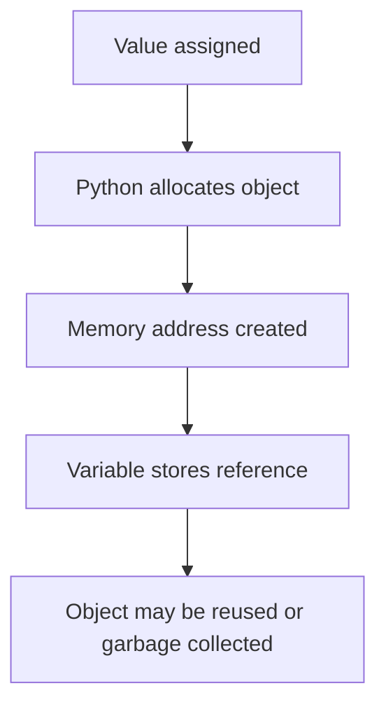

# Memory Allocation Flowchart

```mermaid
flowchart TD
    A[Value assigned] --> B[Python allocates object]
    B --> C[Memory address created]
    C --> D[Variable stores reference]
    D --> E[Object may be reused or garbage collected]
```
