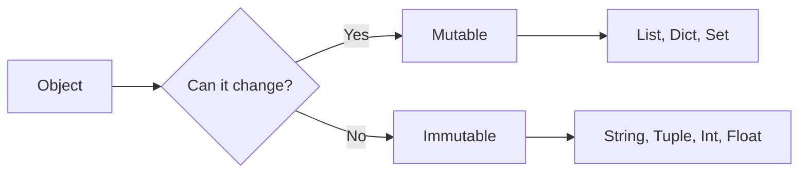

# Mutable vs Immutable Flowchart

```mermaid
flowchart LR
    A[Object] --> B{Can it change?}
    B -->|Yes| C[Mutable]
    B -->|No| D[Immutable]
    C --> E[List, Dict, Set]
    D --> F[String, Tuple, Int, Float]
```
