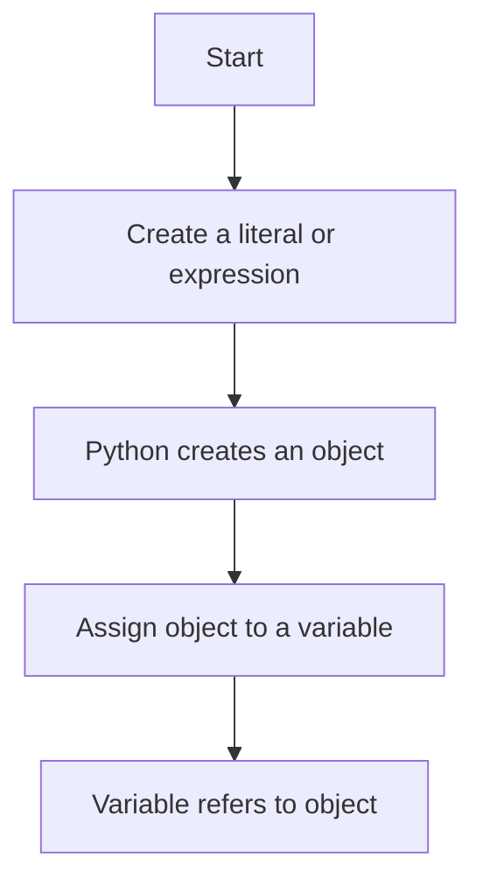

# Object Creation Flowchart

```mermaid
flowchart TD
    A[Start] --> B[Create a literal or expression]
    B --> C[Python creates an object]
    C --> D[Assign object to a variable]
    D --> E[Variable refers to object]
```
