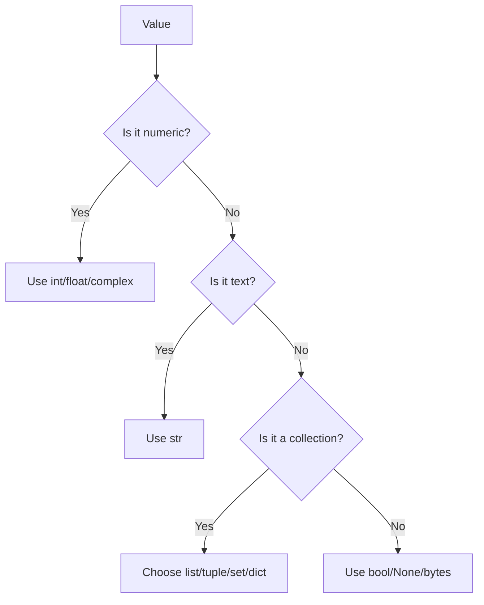

# Type Checking Flowchart

```mermaid
flowchart TD
    A[Value] --> B{Is it numeric?}
    B -->|Yes| C[Use int/float/complex]
    B -->|No| D{Is it text?}
    D -->|Yes| E[Use str]
    D -->|No| F{Is it a collection?}
    F -->|Yes| G[Choose list/tuple/set/dict]
    F -->|No| H[Use bool/None/bytes]
```
