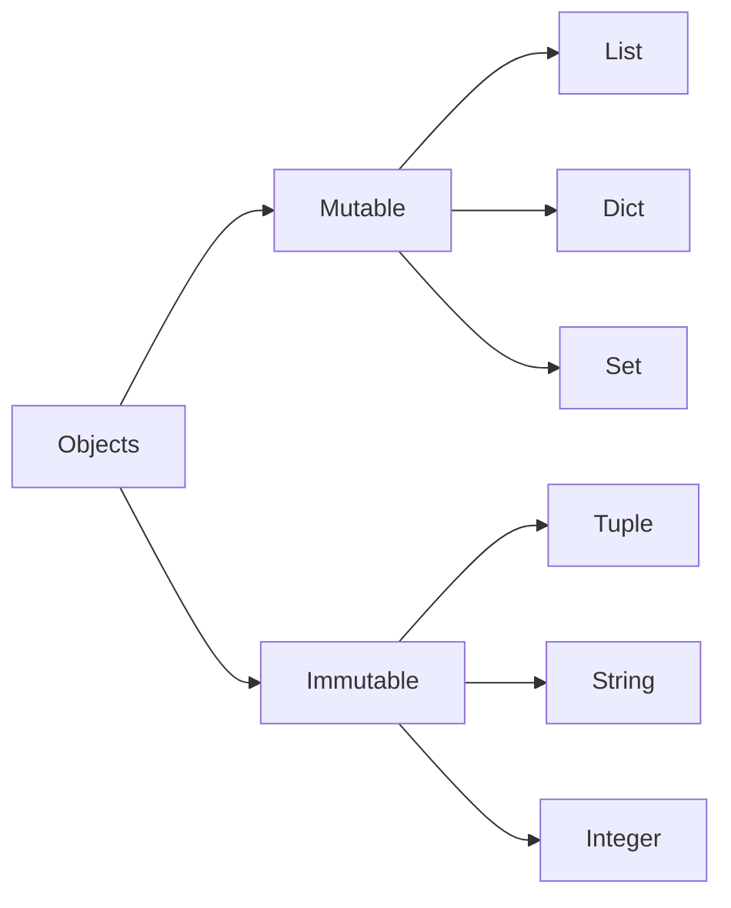
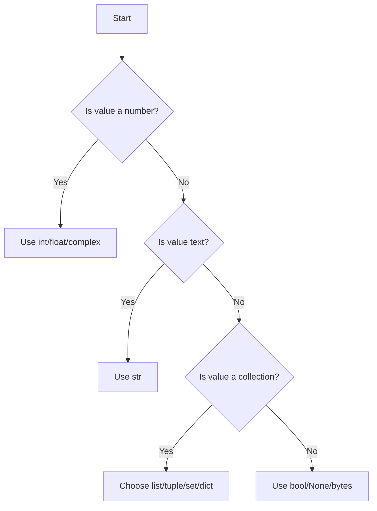

# Theory: Data Types in Python

## 1. What Are Data Types?

A data type describes the kind of value stored in memory. It tells Python:

- what operations are valid
- how much memory is needed
- whether the value can change
- how the value should be interpreted

For example, the integer `42` and the string `"42"` are different values. One is a number; the other is text.

## 2. Why Programming Languages Need Data Types

Programming languages use data types to make programs safer and more predictable.

### Benefits

- prevent invalid operations
- improve memory efficiency
- support compiler and interpreter optimizations
- make code easier to understand
- enable better debugging

## 3. How Python Stores Values

Python stores values as objects. Each object has:

- a type
- a value
- identity
- references

```python
x = 10
```

Here, `x` is a variable that refers to an object representing the integer `10`.

## 4. Dynamic Typing

Python is dynamically typed. This means you do not declare the type of a variable explicitly.

```python
name = "Alice"
name = 25
```

The same variable can refer to different types at different times.

## 5. Static vs Dynamic Typing

| Feature | Static Typing | Dynamic Typing |
|---|---|---|
| Type checked | At compile time | At runtime |
| Example | Java, C++ | Python, JavaScript |
| Flexibility | Less flexible | More flexible |
| Error detection | Early | Later |

## 6. Strong vs Weak Typing

Python is strongly typed. This means Python does not silently combine incompatible types in confusing ways.

```python
"2" + 2
```

This raises a `TypeError`.

## 7. Memory Concepts

Internally, Python uses memory to store objects. The size of an object depends on its type and content.

### Key ideas

- variables store references to objects
- objects live in memory
- some objects are small and reused
- some objects are larger and unique

## 8. Object Model

Everything in Python is an object.

```python
x = 5
print(type(x))
```

This shows that `x` points to an object of type `int`.

## 9. Mutability and Immutability

A mutable object can change after creation. An immutable object cannot.

### Immutable types

- `int`
- `float`
- `complex`
- `bool`
- `str`
- `tuple`
- `frozenset`
- `range`
- `bytes`
- `NoneType`

### Mutable types

- `list`
- `dict`
- `set`
- `bytearray`
- `memoryview` (in many practical contexts)

## 10. Identity and References

- `id(value)` gives the object's identity
- `==` checks value equality
- `is` checks identity

```python
a = [1, 2, 3]
b = a
print(a is b)  # True
```

## 11. Variables vs Objects

A variable is a name. An object is the stored value.

```python
x = [1, 2, 3]
```

`x` is the variable; `[1, 2, 3]` is the object.

## 12. Garbage Collection Overview

Python uses automatic garbage collection to free memory from objects that are no longer referenced.

This helps prevent memory leaks in many programs.

## 13. Built-in Data Types

### 13.1 `int`

- Definition: whole numbers
- Syntax: `10`, `-3`, `0`
- Use cases: counters, ages, indices
- Memory notes: integers are objects, and Python handles arbitrary precision

### 13.2 `float`

- Definition: decimal numbers
- Syntax: `3.14`, `-0.5`, `1e3`
- Use cases: measurements, scientific calculations

### 13.3 `complex`

- Definition: numbers with a real and imaginary part
- Syntax: `3 + 2j`
- Use cases: engineering, signal processing, scientific computing

### 13.4 `bool`

- Definition: truth values
- Syntax: `True`, `False`
- Use cases: conditions, flags, feature toggles

### 13.5 `str`

- Definition: text data
- Syntax: `'hello'`, `"world"`, `'''text'''`
- Use cases: names, messages, documents, prompts

### 13.6 `list`

- Definition: ordered, mutable collection
- Syntax: `[1, 2, 3]`
- Use cases: dynamic data, queues, sequences

### 13.7 `tuple`

- Definition: ordered, immutable collection
- Syntax: `(1, 2, 3)`
- Use cases: fixed records, coordinates, return values

### 13.8 `set`

- Definition: unordered collection of unique values
- Syntax: `{1, 2, 3}`
- Use cases: membership tests, removing duplicates

### 13.9 `frozenset`

- Definition: immutable set
- Syntax: `frozenset({1, 2, 3})`
- Use cases: constant collections used in hashing contexts

### 13.10 `dict`

- Definition: key-value mapping
- Syntax: `{"name": "Ava", "age": 21}`
- Use cases: configuration, JSON-like data, records

### 13.11 `range`

- Definition: sequence of integers
- Syntax: `range(5)`
- Use cases: loops, indexing, iteration

### 13.12 `bytes`

- Definition: immutable binary data
- Syntax: `b"hello"`
- Use cases: file contents, network packets

### 13.13 `bytearray`

- Definition: mutable bytes
- Syntax: `bytearray(b"abc")`
- Use cases: binary manipulation

### 13.14 `memoryview`

- Definition: view over binary data
- Syntax: `memoryview(b"abc")`
- Use cases: efficient binary processing

### 13.15 `NoneType`

- Definition: represents absence of a value
- Syntax: `None`
- Use cases: defaults, missing results, optional values

## 14. Type Comparison Table

| Data Type | Mutable | Ordered | Indexed | Duplicates | Common Use |
|---|---|---:|---:|---:|---|
| `int` | No | N/A | N/A | N/A | numbers |
| `float` | No | N/A | N/A | N/A | decimals |
| `complex` | No | N/A | N/A | N/A | math |
| `bool` | No | N/A | N/A | N/A | conditions |
| `str` | No | Yes | Yes | Yes | text |
| `list` | Yes | Yes | Yes | Yes | dynamic collections |
| `tuple` | No | Yes | Yes | Yes | fixed records |
| `set` | Yes | No | No | No | uniqueness |
| `frozenset` | No | No | No | No | immutable uniqueness |
| `dict` | Yes | No* | Yes by key | No keys | mappings |
| `range` | No | Yes | Yes | No | loops |
| `bytes` | No | Yes | Yes | Yes | binary data |
| `bytearray` | Yes | Yes | Yes | Yes | mutable bytes |
| `memoryview` | Depends | Yes | Yes | N/A | binary views |
| `NoneType` | No | N/A | N/A | N/A | missing value |

## 15. Mermaid Diagrams

### Mutable vs Immutable



### Type Checking Flow



## 16. Summary

Data types are the blueprint for how Python manages information. Understanding them helps you write accurate, efficient, and maintainable software.
